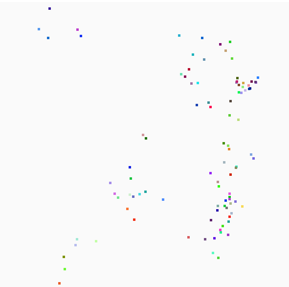

# PyGame Boids
### An Implementation of Boids in PyGame. 

Update v0.1: This was a quick single day project where I wanted to try and write boids just based on my interpretation of the rules. I challenged myself not to look at any other implementations of boids during the process. It is by no means perfect or optimized but it seems to work well enough.

Update v0.2: Some of the shortcomings were bothing me so I have continued to work on this, trying to improve my hastily written naive code. I improved teh center of mass seeking behavior, I also noticed I was calculated the movment vectors wrong, so I fixed that. Mostly improved, but still needs some work.

### Rules
1. **Separation:** steer to avoid crowding local flockmates
2. **Alignment:** steer towards the average heading of local flockmates
3. **Cohesion:** steer to move towards the average position (center of mass) of local flockmates

